# ACE for Cursor

**Automatic Code Evolution** - Pattern learning for Cursor IDE via MCP.

By [Code Engine GmbH](https://ace.code-engine.app)

## Features

- 🔄 **Automatic pattern retrieval** before tasks via MCP
- 📚 **Learning capture** after substantial work
- 🔌 **Native MCP integration** with Cursor
- 📊 **Status panel** for playbook statistics
- ⚙️ **Configure panel** for easy setup

## Quick Start

1. **Install** from Cursor Extensions marketplace
2. **Open Command Palette** (`Cmd+Shift+P` on Mac, `Ctrl+Shift+P` on Windows/Linux)
3. **Run** `ACE: Initialize Workspace` - sets up MCP server and rules
4. **Run** `ACE: Configure Connection` - opens setup panel
5. **Get API token** from [ace.code-engine.app](https://ace.code-engine.app)
6. **Enter credentials** in the Configure panel and save
7. **Start coding!** - AI automatically retrieves patterns before tasks

## Commands

| Command | Description |
|---------|-------------|
| **ACE: Initialize Workspace** | Set up ACE in current workspace (creates `.cursor/` config files, registers MCP server) |
| **ACE: Configure Connection** | Opens webview panel to configure server URL, API token, and select project |
| **ACE: Show Status** | Opens webview panel showing playbook statistics (pattern count, confidence scores) |
| **ACE: Search Patterns** | Search learned patterns by keyword |
| **ACE: Bootstrap Playbook** | Initialize patterns from existing codebase (git history, docs) |
| **ACE: Capture Learning** | Manually trigger learning capture after work |

## Webview Panels

### Configure Panel
Interactive setup wizard for:
- Setting ACE server URL
- Entering API token
- Selecting organization and project
- Testing connection
- Link to create new projects at [ace.code-engine.app](https://ace.code-engine.app)

### Status Panel
Real-time dashboard showing:
- Total patterns in playbook
- Average confidence score
- Patterns by section (strategies, snippets, troubleshooting, APIs)
- Connection status

## How It Works

ACE registers an MCP server with Cursor. The AI automatically:

1. Calls `ace_get_playbook` **before** tasks to retrieve learned patterns
2. Calls `ace_learn` **after** substantial work to capture new patterns

This creates a self-improving learning cycle where each session benefits from previous work.

### The Learning Cycle

```mermaid
flowchart TD
    A["🚀 <b>1. Start Task</b><br/>You begin work in Cursor"] --> B
    B["📖 <b>2. Retrieve Patterns</b><br/>AI calls ace_get_playbook<br/><i>Fetches learned strategies</i>"] --> C
    C["⚡ <b>3. Execute with Knowledge</b><br/>AI completes task using patterns"] --> D
    D["💡 <b>4. Capture Learning</b><br/>AI calls ace_learn<br/><i>Playbook grows smarter</i>"] --> E
    E["🔄 <b>Next Session</b><br/>Enhanced patterns available"] --> A

    style A fill:#e1f5fe,stroke:#01579b
    style B fill:#f3e5f5,stroke:#4a148c
    style C fill:#e8f5e9,stroke:#1b5e20
    style D fill:#fff3e0,stroke:#e65100
    style E fill:#fce4ec,stroke:#880e4f
```

## Requirements

- Cursor IDE (v0.44+)
- ACE account at [ace.code-engine.app](https://ace.code-engine.app)
- API token from the ACE dashboard

## Configuration

### Workspace Settings
Stored in `.cursor/ace/settings.json`:
- `orgId` - Your ACE organization ID
- `projectId` - Your ACE project ID

### Global Settings
Configure in Cursor Settings (`Cmd+,`):
- `ace.serverUrl` - ACE server endpoint (default: https://ace-api.code-engine.app)
- `ace.orgId` - Default organization ID
- `ace.projectId` - Default project ID

## Links

- [ACE Website](https://ace.code-engine.app)
- [Documentation](https://ace.code-engine.app/docs)
- [GitHub](https://github.com/ce-dot-net/ace-cursor)
- [Report Issues](https://github.com/ce-dot-net/ace-cursor/issues)

## License

MIT - Code Engine GmbH
